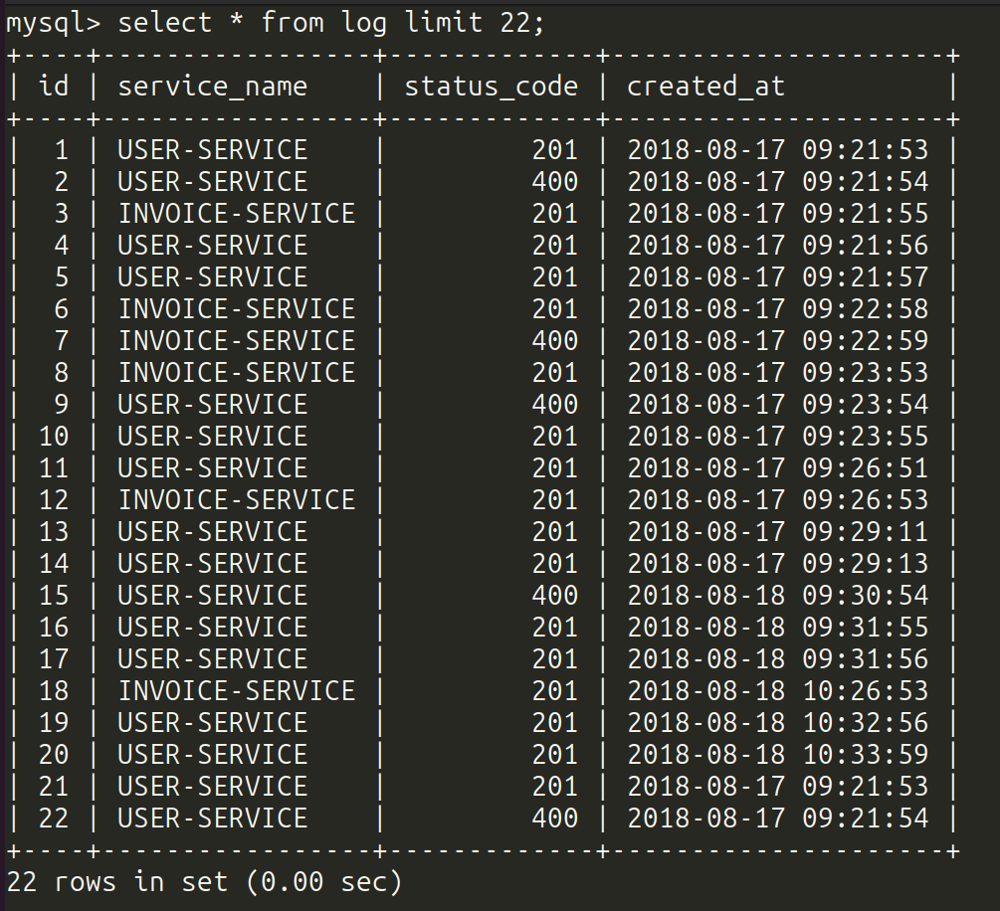

# Log-analytics-API
Welcome to the Log Analytics API! This API allows you to perform log stream analysis with ease.


## Getting Started

To run and test this demo, follow these steps:
1. Navigate to the project folder
2. Use Docker Compose to set up the environment
    ```
    docker compose up -d
    ```
    This command will create the following containers:
     * **mysql**: MySQL database container
     * **app**: Webserver container serving API requests. Dependencies installation and database migrations are automated
     * **cronjob**: Container running a Symfony command every minute to import logs into the database.

3. To manually import logs into the database, follow these steps:
   * Log in to the **app** or **cronjob** container
    ```
    docker exec -it app bash
    ```
   * Run the import command
    ```
    php bin/console app:import-logs
    ```
4. To test the API, send a request to **'http://localhost:8080/count'**. You can include the following parameters in the query string:
   * serviceNames
   * startDate
   * endDate
   * statusCode
   
    The API will return a JSON response with the count of matching results. 

    Example response:

    ```
       {
           "CountItem": {
               "counter": 10
           }
       }
    ```
5. The query parameters will be validated, and if there are any errors, you'll receive a JSON response indicating the errors.

    Example error response:
    ```
    {
        "errors": [
             "Parameter serviceNames must be an array.",
             "Parameter statusCode must be a valid HTTP status code.",
             "Parameter 'startDate' is not a valid date or is not in the format YYYY-MM-DD."
        ]
    }
   ```


## Database Structure
The database is structured as follows:



## Running Unit Tests
To run unit tests, log in to the app container:
```
docker exec -it app bash
```
Then, run PHPUnit:
```
vendor/bin/phpunit
```
